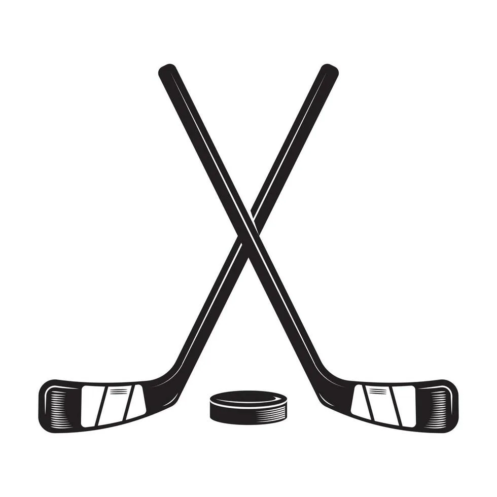

# 🏒 HockeyLine

<div align="center">



> Локальное Flutter-приложение для управления хоккейной командой: состав, звенья, заметки, статистика, экспорт отчётов и администрирование пользователей.

[](https://flutter.dev)
[](https://dart.dev)
[](LICENSE)

[Возможности](#-возможности-приложения) • [Установка](#-запуск-проекта) • [Архитектура](#-архитектура) • [Документация](#-содержание)

</div>

---

## 📋 Содержание

- [Данные для входа](#-данные-для-входа)
- [Возможности приложения](#-возможности-приложения)
- [Роли и права](#-роли-и-права)
- [Архитектура](#-архитектура)
- [Дизайн и UX](#-дизайн-и-ux)
- [Данные и хранение](#-данные-и-хранение)
- [Запуск проекта](#-запуск-проекта)

---

## 🔐 Данные для входа

Приложение поставляется с двумя предустановленными аккаунтами:

### 👨‍💼 Администратор
- **Email:** isip_i.v.egorov@mpt.ru
- **Пароль:** Testuser1
- **Права:** 
  - Полный доступ ко всем функциям
  - Управление пользователями (только удаление)
  - CRUD игроков
  - Расширенное редактирование статистики
  - Экспорт и импорт полных данных (JSON)
- **Защита:** Системный администратор не может быть удалён

### 🎯 Тренер
- **Email:** ilyadobrovolskiy00@gmail.com
- **Пароль:** Testuser2
- **Права:**
  - Работа с составом, заявкой, избранным
  - Ведение заметок по игрокам
  - Просмотр статистики
  - Экспорт и импорт полных данных (JSON)

### 👁️ Гостевой режим
- **Доступ:** Кнопка «Продолжить как гость» на экране входа
- **Права:** Только просмотр интерфейса

---

## ✨ Возможности приложения

### 👥 Управление игроками
- Создание, редактирование, удаление (только admin)
- Поиск по имени/фамилии
- Фильтры: по амплуа, статусу, заявке
- Сортировка: по имени, возрасту
- Избранные игроки
- Заявка на матч
- Поддержка фото (URL или локальный путь)

**Реализация:** [lib/providers/team_provider.dart](lib/providers/team_provider.dart)

### 🔗 Формирование звеньев
- Drag-and-drop интерфейс
- Ограничения: Вратари (2), Нападающие (3), Защитники (2)
- Валидация с диалоговыми окнами

**Реализация:** [lib/providers/lines_provider.dart](lib/providers/lines_provider.dart)

### 📝 Заметки по игрокам
- Создание, редактирование, удаление
- Ролевые ограничения

**Реализация:** [lib/providers/team_provider.dart](lib/providers/team_provider.dart)

### 📊 Статистика и графики
- Круговая диаграмма по амплуа
- Топ-5 по очкам
- Быстрые инкременты (admin)
- Экспорт CSV и PDF

**Реализация:** [lib/providers/stats_provider.dart](lib/providers/stats_provider.dart)

### 💾 Экспорт и импорт
- Полный бэкап JSON (admin и coach)
- Экспорт статистики CSV/PDF
- Android: публичная папка Download

**Реализация:** [lib/services/storage_service.dart](lib/services/storage_service.dart)

---

## 🎭 Роли и права

<div align="center">

| Роль | Просмотр | Состав | Звенья | Заметки | Статистика | Экспорт | Управление |
|:----:|:--------:|:------:|:------:|:-------:|:----------:|:-------:|:----------:|
| **👁️ Guest** | ✅ | ❌ | ❌ | ❌ | ✅ | ❌ | ❌ |
| **🎯 Coach** | ✅ | ✅ | ✅ | ✅ | ✅ | ✅ | ❌ |
| **👨‍💼 Admin** | ✅ | ✅ | ✅ | ✅ | ✅ | ✅ | ✅ |

</div>

### Особенности управления пользователями

**Системный администратор** (`isip_i.v.egorov@mpt.ru`):
- 🛡️ Защищён от удаления
- 🛡️ Защищён от изменения роли
- 🛡️ Не имеет кнопки "Удалить аккаунт" в профиле
- 🛡️ Отображается с чипом "Системный администратор" в панели управления

**Обычные администраторы:**
- ⚙️ Отображаются с чипом "Администратор"
- ⚙️ Не могут быть удалены
- ⚙️ Роль не может быть изменена

**Тренеры и гости:**
- ✏️ Роль может быть изменена администратором
- 🗑️ Могут быть удалены администратором

**Реализация:** [lib/providers/auth_provider.dart](lib/providers/auth_provider.dart)

---

## 🏗️ Архитектура

### Структура кода

`
lib/
├── main.dart                    # Точка входа
├── app.dart                     # Корневой виджет
├── models/                      # Модели данных
├── providers/                   # State Management (Provider)
├── screens/                     # Экраны приложения
├── services/                    # Сервисы (Storage)
├── theme/                       # Тема и стили
├── utils/                       # Валидация
└── widgets/                     # UI-компоненты
`

### Ключевые файлы

- [lib/theme/app_theme.dart](lib/theme/app_theme.dart) — тёмная тема, цвета
- [lib/widgets/design_widgets.dart](lib/widgets/design_widgets.dart) — UI-компоненты
- [lib/services/storage_service.dart](lib/services/storage_service.dart) — работа с JSON
- [lib/providers/auth_provider.dart](lib/providers/auth_provider.dart) — авторизация
- [lib/screens/home_shell_screen.dart](lib/screens/home_shell_screen.dart) — главный экран

---

## 🎨 Дизайн и UX

### Цветовая палитра

| Элемент | Hex |
|---------|-----|
| Акцент | #D32F2F |
| Фон | #121212 |
| Поверхности | #1A1A1A |
| Навигация | #2C2C2C |
| Карточки игроков | #FFFFFF |

**Реализация:** [lib/theme/app_theme.dart](lib/theme/app_theme.dart)

### Адаптивность

| Ширина | Навигация | Сетка |
|--------|-----------|-------|
| < 880px | NavigationBar (внизу) | 1 колонка |
| ≥ 880px | NavigationRail (слева) | 2-3 колонки |

---

## 💾 Данные и хранение

### Расположение файлов

| Платформа | Путь |
|-----------|------|
| Android/iOS | getApplicationDocumentsDirectory()/hockeyline_data.json |
| Desktop | Directory.current/hockeyline_data.json |
| Web | SharedPreferences |

**Реализация:** [lib/services/storage_service.dart](lib/services/storage_service.dart)

### Формат данных

`json
{
  "users": [...],
  "players": [...],
  "lines": [...],
  "notes": [...],
  "meta": {"updatedAt": "2026-05-05T09:30:00.000Z"}
}
`

**Пример:** [hockeyline_data.json](hockeyline_data.json)

---

## 🔧 Валидация

| Поле | Правило |
|------|---------|
| Email | user@domain.com |
| Пароль | ≥8 символов, A-z, цифра |
| Имя/Фамилия | Только буквы, 1-30 символов |
| Номер | 1-99, уникальный |
| Возраст | 14-60 лет |

**Реализация:** [lib/utils/validators.dart](lib/utils/validators.dart)

**Отображение ошибок:** Диалоговые окна — [lib/widgets/design_widgets.dart](lib/widgets/design_widgets.dart)

---

## 🚀 Запуск проекта

### Требования
- Flutter SDK 3.11.1+ (stable)
- Dart 3.11.1+

### Установка и запуск

```bash
# Клонирование репозитория
git clone <repository-url>
cd hockeyline

# Установка зависимостей
flutter pub get

# Генерация иконок приложения
flutter pub run flutter_launcher_icons

# Запуск приложения
flutter run

# Анализ кода
flutter analyze
```

### Зависимости

**Основные:**
- `provider: ^6.1.5` — State management
- `path_provider: ^2.1.5` — Файловая система
- `shared_preferences: ^2.5.3` — Сессии
- `csv: ^6.0.0` — Экспорт CSV
- `file_picker: ^10.3.2` — Выбор файлов
- `fl_chart: ^1.1.1` — Графики
- `pdf: ^3.11.3` — Генерация PDF

**Dev:**
- `flutter_lints: ^6.0.0` — Линтер
- `flutter_launcher_icons: ^0.13.1` — Генерация иконок

**Конфигурация:** [pubspec.yaml](pubspec.yaml)

### Иконка приложения

Иконка приложения (`клюшка.jpg`) автоматически генерируется для всех платформ:
- ✅ Android (adaptive icon)
- ✅ iOS (все размеры)
- ✅ Web (favicon)
- ✅ Windows
- ✅ macOS
- ✅ Linux

**Конфигурация:** См. секцию `flutter_launcher_icons` в [pubspec.yaml](pubspec.yaml)

---

<div align="center">

**Сделано с ❤️ для управления хоккейными командами**

🏒 HockeyLine © 2026

</div>
